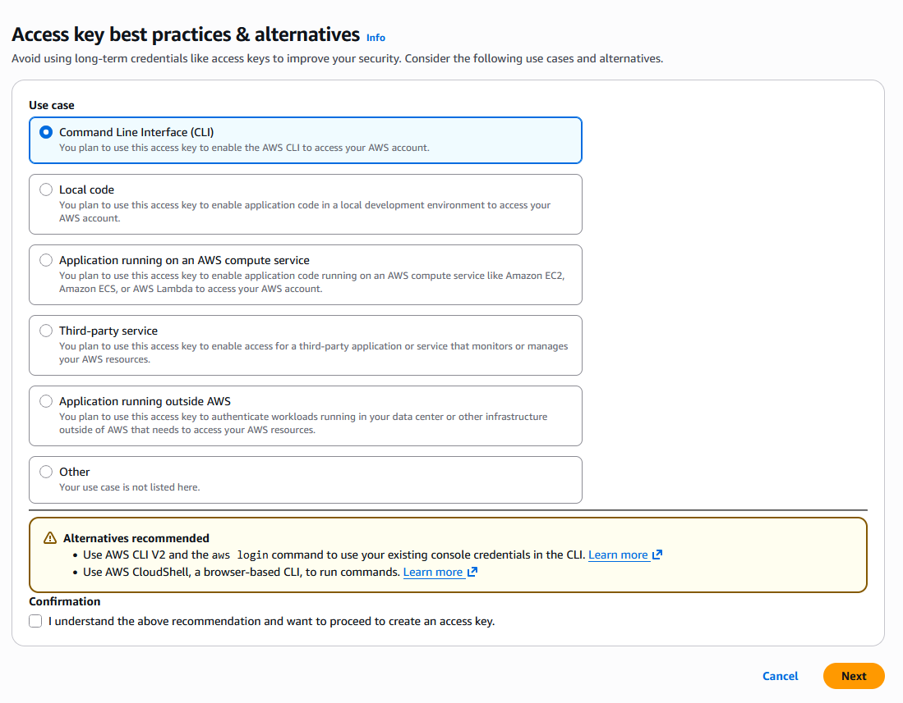
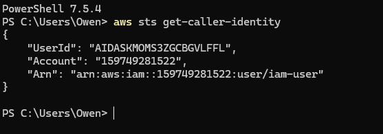
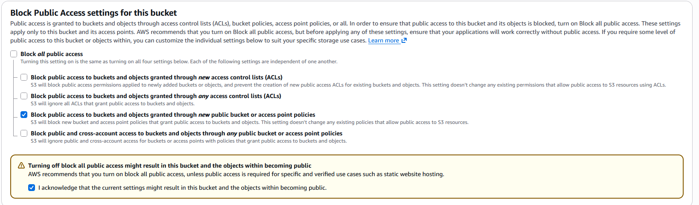
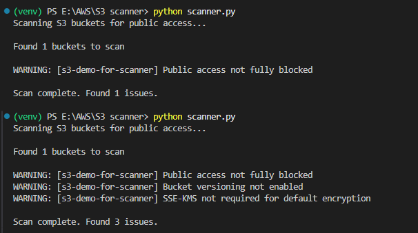

# S3 Scanner

In 2019, Capital One exposed more than 100M customer records due to an S3 misconfiguration and paid a large penalty. A significant share of cloud breaches come from simple misconfigurations. This project automates basic security checks for S3 buckets using Python and `boto3` to help catch those issues early.

## What this does

- Scans an S3 bucket for common misconfigurations
- Prints a clear summary so you can fix problems quickly

## Prerequisites

- AWS account with access to the target bucket
- AWS CLI configured with API keys
- Python 3.x
- `boto3`

## Setup

1. Create AWS API keys and configure the CLI so `boto3` can authenticate.



2. Verify the AWS CLI is correctly configured.



3. Create a test bucket (example used in this project: `s3-demo-for-scanner`).



## Run the scanner

```bash
python scanner.py
```

Example results:



## Notes

- This is a simple security check, not a full audit.
- Use a least-privilege IAM user for scanning.
